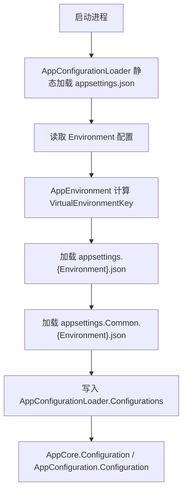

# 配置文件

Air.Cloud 的配置机制不是简单读取 `appsettings.json`。它会先确定运行环境，再加载环境配置和公共配置，最后把配置汇总到框架统一的配置入口中。

配置加载是 `Air.Cloud.Core` 的核心能力之一。理解这条链路，对排查模块配置、生产环境配置、公共配置覆盖都很重要。

---

## 配置加载总览



默认入口：

- `appsettings.json`：基础配置，主要用于确定环境和放置通用启动项。
- `appsettings.{Environment}.json`：当前环境配置。
- `appsettings.Common.{Environment}.json`：当前环境公共配置。

示例：如果 `Environment` 为 `Production`，框架会尝试加载：

```text
appsettings.json
appsettings.Production.json
appsettings.Common.Production.json
```

这些文件都是 `optional: true`，文件不存在不会直接导致启动失败，但缺少关键配置会导致模块运行失败。

---

## 环境选择机制

环境由 `AppEnvironment.VirtualEnvironmentKey` 决定。常见来源如下：

### 1. 手动指定 Environment

在 `appsettings.json` 中写入：

```json
{
  "Environment": "Development"
}
```

此时会加载：

```text
appsettings.Development.json
appsettings.Common.Development.json
```

也可以指定自定义环境名：

```json
{
  "Environment": "PreProduction"
}
```

此时会加载：

```text
appsettings.PreProduction.json
appsettings.Common.PreProduction.json
```

### 2. 自动判断环境

如果没有手动指定，框架会根据运行状态推断：

| 条件 | 环境 |
| --- | --- |
| 调试器附加 | `Development` |
| 应用运行路径包含 `test` | `Test` |
| 其他情况 | `Production` |

手动指定优先级最高。

---

## Common 是保留关键字

不能把环境名设置为 `Common`：

```json
{
  "Environment": "Common"
}
```

这会触发异常。原因是 `Common` 用于公共配置文件命名：

```text
appsettings.Common.{Environment}.json
```

例如：

```text
appsettings.Common.Production.json
```

它表示“生产环境下所有服务共享的公共配置”，不是一个运行环境。

---

## 加载入口

Web 应用通常通过 `WebInjectInFile()` 进入配置加载：

```csharp
var builder = WebApplication.CreateBuilder(args);
var app = builder.WebInjectInFile();
app.Run();
```

内部会执行：

```csharp
AppRealization.Configuration.LoadConfiguration(AppConst.SystemEnvironmentConfigFileFullName, false);
AppRealization.Configuration.LoadConfiguration(AppConst.CommonEnvironmentConfigFileFullName, true);
```

Host 或其他应用类型可以通过：

```csharp
AppConfiguration.AppDefaultInjectConfiguration<TAppInjectImplementation>(
    AppStartupTypeEnum.HOST,
    LoadConfigurationTypeEnum.File,
    Assembly.GetEntryAssembly());
```

实际项目一般不需要直接调用底层方法，除非你在扩展新的应用宿主类型。

---

## 配置文件覆盖关系

加载顺序通常是：

1. `appsettings.json`
2. `appsettings.{Environment}.json`
3. `appsettings.Common.{Environment}.json`

由于后加载配置会加入同一个配置管理器，同名 Key 的读取结果可能受后加载配置影响。

建议规则：

- 服务私有配置放在 `appsettings.{Environment}.json`。
- 多服务共享配置放在 `appsettings.Common.{Environment}.json`。
- `appsettings.json` 只放启动引导配置，例如 `Environment` 和少量基础开关。
- 不要在公共配置里覆盖服务私有配置，除非这是明确设计。

---

## 强类型配置

推荐使用强类型 Options 承载配置：

```csharp
[ConfigurationInfo("KafkaSettings")]
public class KafkaSettingsOptions : IConfigurableOptions
{
    public string ClusterAddress { get; set; }
}
```

读取方式：

```csharp
var options = AppCore.GetOptions<KafkaSettingsOptions>();
```

或：

```csharp
var options = AppConfiguration.GetConfig<KafkaSettingsOptions>("KafkaSettings", true);
```

如果类型上有 `ConfigurationInfoAttribute`，可以省略配置节名称。`loadPostConfigure` 为 `true` 时，会调用 Options 的 `PostConfigure` 补齐默认值。

---

## 配置热更新

默认配置加载使用：

```csharp
AddJsonFile(fileName, optional: true, reloadOnChange: true)
```

这意味着 JSON 文件变化后可以触发配置重新加载。

框架也提供配置变更监听入口：

```csharp
AppConfiguration.AddChangeReloadFunction("Kafka", () =>
{
    // 配置变化后执行刷新逻辑。
});

AppConfiguration.StartListenChangeReloadFunction();
```

注意：配置热更新只能说明配置值变了，不代表所有模块都会自动重建连接。例如 Kafka、Redis、Consul 等外部连接是否重连，取决于对应模块是否实现了刷新逻辑。

---

## 典型配置结构

### appsettings.json

```json
{
  "Environment": "Production",
  "AppSettings": {
    "EnabledReferenceAssemblyScan": false,
    "SupportPackageNamePrefixs": [ "Air" ]
  }
}
```

### appsettings.Production.json

```json
{
  "KafkaSettings": {
    "ClusterAddress": "192.168.100.154:9092",
    "ProducerConfigs": [
      {
        "TopicName": "fcj_network_service"
      }
    ],
    "ConsumerConfigs": [
      {
        "TopicName": "fcj_network_service",
        "ConsumerConfig": {
          "GroupId": "fcj_networker_workflow",
          "EnableAutoCommit": false,
          "PartitionAssignmentStrategy": "Range",
          "AutoCommitIntervalMs": "100"
        }
      }
    ]
  }
}
```

### appsettings.Common.Production.json

```json
{
  "TraceLog": {
    "Enabled": true
  },
  "ServiceCenter": {
    "ClusterAddress": "http://consul.service:8500"
  }
}
```

---

## 模块配置建议

模块配置要尽量遵守以下规则：

- 配置节名称与 Options 类型保持稳定，例如 `KafkaSettings` 对应 `KafkaSettingsOptions`。
- 列表项必须能被模块按业务键匹配，例如 Topic、Name、GroupId。
- 如果业务没有配置某一项，模块应尽量创建默认配置，而不是直接报错。
- 生产配置不要依赖开发默认值。
- 公共配置只放真正共享的内容，例如注册中心地址、公共日志策略。

---

## 排查配置未生效

按下面顺序检查：

1. `appsettings.json` 中的 `Environment` 是否正确。
2. 实际文件名是否为 `appsettings.{Environment}.json`。
3. 是否错误使用了 `Common` 作为环境名。
4. 公共配置文件名是否为 `appsettings.Common.{Environment}.json`。
5. 配置节名称是否与 Options 读取名称一致。
6. 配置值类型是否能被 .NET Configuration 正确绑定。
7. 读取配置的时机是否早于 `WebInjectInFile()` 或应用注入流程。

配置问题不要只看单个 JSON 文件，要按“环境选择 -> 文件加载 -> 配置节绑定 -> 模块注册”的链路排查。
