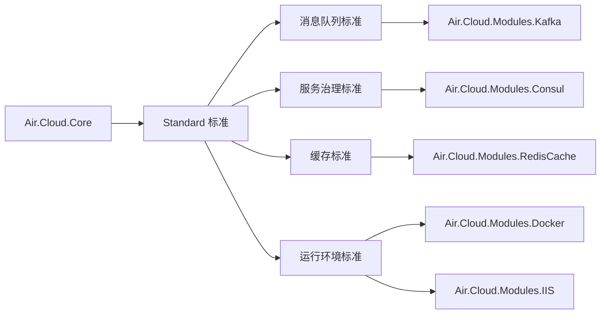

# 模块

模块（Module）是 Air.Cloud 对运行时能力的实现包。Core 只定义标准，模块负责把标准落地，例如连接 Kafka、Redis、Consul、数据库或调度框架。

模块的使用原则是：用什么，引什么；不用的能力不要放进项目依赖里。

---

## 模块和 Standard 的关系

模块不应该只是一个工具包，它应该回答一个问题：它实现了哪个标准，或者补充了哪个运行时能力。



侧边栏中的“模块”也按这个思路组织：先按 Standard 建分组，再把具体模块文档挂到对应 Standard 下。

---

## 按 Standard 分组

以下清单根据当前源码目录核对整理。`详细文档` 为空表示源码中存在模块或标准实现，但当前文档站还没有单独模块使用页。

| Standard / 能力边界 | 对应模块 | 源码中确认的实现 | 详细文档 |
| --- | --- | --- | --- |
| 消息队列标准 | `Air.Cloud.Modules.Kafka` | `IMessageQueueStandard`、`IMessageQueueKeyGenerator<TKey>`、`IMessageQueueConsumerRecoveryStandard`、`IMessageQueueFailureCompensationStandard` | Kafka |
| 服务治理标准 | `Air.Cloud.Modules.Consul` | `IServerCenterStandard`、`IKVCenterStandard`、`IConsulServiceOptionsConfigureStandard` | Consul |
| 缓存标准 | `Air.Cloud.Modules.RedisCache` | `IAppCacheStandard`、`IRedisCacheStandard`、`IRedisCacheKeyStandard` |  |
| 分布式锁标准 | `Air.Cloud.Modules.RedisCache` | `IDistributedLockStandard` |  |
| 运行容器标准 | `Air.Cloud.Modules.Docker` | `IContainerStandard` |  |
| 运行容器标准 | `Air.Cloud.Modules.IIS` | `IContainerStandard` |  |
| 追踪日志标准 | `Air.Cloud.Modules.SkyWalking` | `ITraceLogStandard` |  |
| 调度任务标准 | `Air.Cloud.Modules.Quartz` | `ISchedulerStandardOptions`、`ISchedulerStandardFactory<T>` |  |
| 远程调用标准 | `Air.Cloud.Modules.Taxin` | `ITaxinClientStandard`、`ITaxinServerStandard`、`ITaxinStoreStandard` |  |
| 对象存储标准 | `Air.Cloud.Modules.AmazonS3` | `IAmazonS3Standard`、`IAmazonS3ClientStandard`、`IAmazonS3BucketStandard`、`IAmazonS3ObjectStandard` |  |
| NoSQL 数据访问扩展 | `Air.Cloud.Modules.ElasticSearch` | `INoSqlRepository<T>` 仓储注册、ElasticSearch 索引特性、连接池 |  |
| SkyMirrorShield 标准 | `Air.Cloud.Modules.SkyMirrorShield` | `ISkyMirrorShieldServerStandard` |  |

::: tip 说明
“详细文档”列不是源码能力判断标准。它只表示文档站当前是否已经有独立使用手册。模块是否存在，以 `src/modules` 下的项目和代码注册为准。
:::

---

## 当前模块目录核对

当前 `src/modules` 下存在以下模块，文档清单已按源码目录核对：

| 类库 | 当前归类 | 主要用途 |
| --- | --- | --- |
| `Air.Cloud.Modules.Akka` | 扩展模块 | Actor 模型、并发任务场景 |
| `Air.Cloud.Modules.AmazonS3` | 对象存储标准 | S3 对象存储、Bucket、Object、Client 能力 |
| `Air.Cloud.Modules.Consul` | 服务治理标准 | 配置中心、服务注册发现、KV 中心 |
| `Air.Cloud.Modules.Courier` | 扩展模块 | 通知、投递或传输扩展能力 |
| `Air.Cloud.Modules.Docker` | 运行容器标准 | Docker 环境识别、容器信息能力 |
| `Air.Cloud.Modules.ElasticSearch` | NoSQL 数据访问扩展 | ElasticSearch 索引、连接池、NoSQL 仓储实现 |
| `Air.Cloud.Modules.IIS` | 运行容器标准 | IIS 宿主环境适配 |
| `Air.Cloud.Modules.Kafka` | 消息队列标准 | 发布订阅、消费补偿、消费恢复 |
| `Air.Cloud.Modules.MongoDB` | 数据访问扩展 | MongoDB 文档数据库访问 |
| `Air.Cloud.Modules.Netty` | 扩展模块 | 网络通信扩展 |
| `Air.Cloud.Modules.Nexus` | 扩展模块 | 制品或仓储相关扩展 |
| `Air.Cloud.Modules.Ocelot` | 网关扩展 | API 网关、路由转发 |
| `Air.Cloud.Modules.Quartz` | 调度任务标准 | 定时任务、周期任务 |
| `Air.Cloud.Modules.RedisCache` | 缓存标准 / 分布式锁标准 | Redis 缓存、Redis 标准实现、Redis 分布式锁 |
| `Air.Cloud.Modules.SkyMirrorShield` | SkyMirrorShield 标准 | SkyMirrorShield 服务端能力 |
| `Air.Cloud.Modules.SkyWalking` | 追踪日志标准 | SkyWalking 链路追踪、服务观测 |
| `Air.Cloud.Modules.Taxin` | 远程调用标准 | 服务间调用、路由存储 |

---

## 数据库与扩展类库

数据库相关能力单独在 `src/db` 下维护，不放入 `src/modules`，但仍属于 Air.Cloud 的运行时能力扩展。

| 类库 | 主要用途 |
| --- | --- |
| `Air.Cloud.DataBase.FreeSql` | FreeSql 数据访问 |
| `Air.Cloud.DataBase.SqlLite` | SQLite 数据访问 |
| `Air.Cloud.EntityFrameWork.Core` | EF Core 公共能力 |
| `Air.Cloud.EntityFrameWork.MySQL` | MySQL EF Core 支持 |
| `Air.Cloud.EntityFrameWork.Oracle` | Oracle EF Core 支持 |
| `Air.Cloud.EntityFrameWork.PostgreSQL` | PostgreSQL EF Core 支持 |

扩展类库：

| 类库 | 主要用途 |
| --- | --- |
| `Air.Cloud.Core.Extensions` | Core 扩展方法与宿主扩展 |

---

## 模块接入方式

模块通常由对应包中的 `AppStartup` 被 Core 扫描后自动接入。部分模块也提供显式扩展方法：

```csharp
// Consul 需要尽早参与远程配置加载和服务注册，通常使用专门入口。
var app = builder.WebInjectInConsul();

// RedisCache、Kafka、ElasticSearch 等模块通常在引入包后由 Startup 绑定配置并注册服务。
```

不同模块的实际接入方式不同，应以对应模块文档和源码为准。

模块接入后通常会做几件事：

1. 读取模块自己的配置节。
2. 注册标准实现到 DI。
3. 注册后台服务、消费者、客户端或连接池。
4. 如有 `AppStartup`，由 Core 统一扫描并调用。
5. 如有中间件或过滤器，在启动管道中装配。

---

## Startup 自动加载

模块可以通过继承 `AppStartup` 参与应用启动：

```csharp
[AppStartup(Order = 100)]
public class KafkaStartup : AppStartup
{
    public override void ConfigureServices(IServiceCollection services)
    {
        services.AddKafkaService();
    }

    public override void Configure(IApplicationBuilder app, IWebHostEnvironment env)
    {
    }
}
```

框架会在 `AddApplication()` 中扫描所有 `AppStartup`：

- 先按依赖关系排序。
- 再按 `Order` 排序。
- 同层级按类型全名稳定排序。
- 调用 `ConfigureServices(IServiceCollection services)`。
- 应用启动管道中再调用 `Configure(IApplicationBuilder app, ...)`。

如果 Startup 之间有明确依赖，应使用 `DependType` 指定，而不是单纯依赖相同 `Order` 的偶然顺序。

---

## 动态模块加载

Air.Cloud 支持运行时加载动态模块。默认动态模块目录是应用运行目录下的：

```text
Mods/{模块名}/lib/{模块名}.dll
```

加载流程：

1. `DynamicAppStoreDependency` 扫描 `Mods` 目录。
2. 按子目录名称查找同名 DLL。
3. 使用独立 `AssemblyLoadContext` 加载主程序集和依赖程序集。
4. 扫描模块中的标准、模块、增强、动态服务等关键类型。
5. 将扫描结果合并进 `AppCore.CrucialTypes`。
6. 如果模块包含动态服务，会加入 MVC `ApplicationPartManager`。

动态模块适合“可插拔部署”场景；普通业务项目优先使用 NuGet 引用和显式注册，调试和排错更简单。

---

## 模块实现标准的建议

模块实现标准时建议遵守：

- 标准实现只负责标准职责，不要混入业务规则。
- 外部连接使用单例、连接池或客户端工厂，不要每次调用创建连接。
- 配置项使用强类型 Options，并提供合理默认值。
- 消费者、调度器等长生命周期任务使用 `IHostedService` 或模块内启动服务承载。
- 默认实现使用 `TryAdd` 时要允许业务覆盖；使用 `Add` 时要明确是否允许多实现。

---

## 常见问题

### 引入模块后标准仍然未实现

按下面顺序检查：

1. 模块包是否被项目引用。
2. 是否调用了模块注册方法。
3. 配置节名称是否正确。
4. 标准实现是否注册到了 DI。
5. 是否被另一个实现覆盖。
6. 是否调用 `AppRealization.X` 的时机太早。

### 多个模块实现同一个标准

例如同时引入两个消息队列模块，必须明确最终使用哪个 `IMessageQueueStandard`。不要依赖扫描顺序。

推荐做法：

```csharp
services.AddSingleton<IMessageQueueStandard, MyPreferredQueueStandard>();
```

或者由模块提供具名注册、工厂或配置选择机制。
