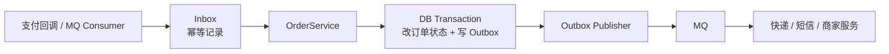
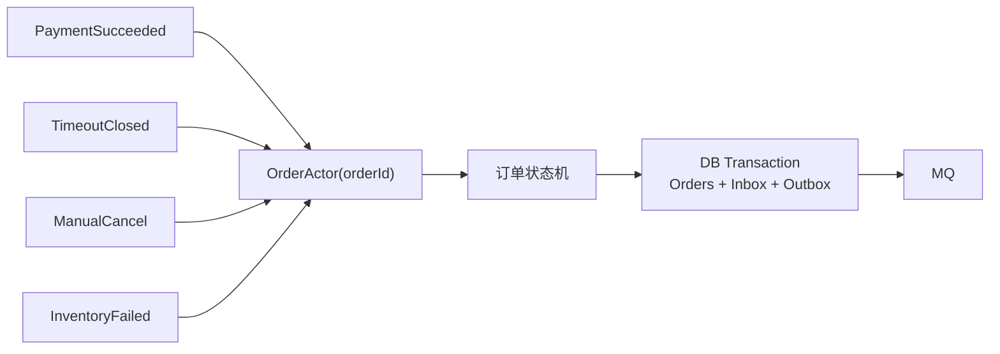
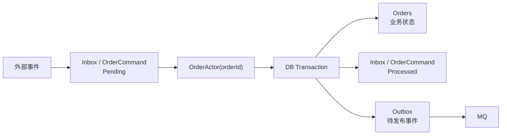

# Akka 应用范式

## 1. 先判断是否真的需要 Actor

Akka.NET 不是消息队列、不是 RPC 框架，也不是普通 Service 方法的替代品。  
在微服务场景下，Actor 更适合解决“同一个业务实体的并发状态流转、长流程编排、超时补偿和串行决策”问题，而不是为了把消息发到 MQ 再额外加一层模型。

| 场景 | 推荐方案 | 是否建议引入 Actor |
| --- | --- | --- |
| 支付回调只做签名校验、幂等、改订单状态、写 Outbox | `Controller/Consumer -> Service -> DB + Outbox -> MQ` | 不建议 |
| 订单完成后通知库存、仓储、快递、短信、商家 | `Outbox -> MQ -> 下游服务订阅` | 不建议只为通知引入 |
| 同一个订单同时收到支付成功、超时关闭、人工取消、库存失败、风控拒绝 | `OrderActor(orderId) -> 状态机 -> DB + Outbox` | 建议 |
| 订单生命周期需要延迟任务、重试、补偿、Saga 编排 | `Actor + 状态机 + Inbox/Outbox` | 建议 |
| 跨微服务直接调用对方 Actor | `MQ / HTTP / gRPC` | 默认不建议 |

结论很明确：

- 如果 Actor 里只做“改订单状态 + 发 MQ”，那大概率是多余复杂度。
- 如果业务已经需要按 `OrderId` 串行处理多个冲突事件，Actor 才开始有价值。
- 跨服务通知仍然优先使用 MQ，Actor 主要用于服务内部或同业务服务集群内的并发治理。

## 2. 直接模式：简单订单流转

如果支付结果处理逻辑很简单，直接使用 `Inbox + Outbox` 即可：



这种模式已经可以解决：

- `Inbox` 记录外部事件，避免重复回调重复处理。
- `Orders.Status` 通过状态条件更新，避免非法流转。
- `Outbox` 和订单状态在同一个事务内提交，避免状态成功但消息丢失。
- `OutboxPublisher` 负责 MQ 失败后的重推。

示例：

```csharp
public async Task HandlePaymentSucceededAsync(PaymentSucceeded message)
{
    await unitOfWork.ExecuteAsync(async () =>
    {
        if (await inbox.ExistsProcessedAsync(message.EventId))
        {
            return;
        }

        var order = await orderRepository.GetAsync(message.OrderId);

        if (order is null || order.Status != OrderStatus.PendingPayment)
        {
            await inbox.MarkProcessedAsync(message.EventId);
            return;
        }

        order.MarkPaid(message.PaymentId, message.Amount, message.PaidAt);

        await orderRepository.UpdateAsync(order);
        await outbox.WriteAsync(new OrderPaidIntegrationEvent(
            message.EventId,
            message.OrderId,
            message.PaymentId,
            message.Amount,
            message.PaidAt));

        await inbox.MarkProcessedAsync(message.EventId);
    });
}
```

这个场景不需要 Actor。直接模式更少组件、更容易排查，也更符合大多数简单订单链路。

## 3. Actor 模式：并发事件收敛

当同一个订单会同时收到多个事件时，问题不再是“怎么发 MQ”，而是“谁有资格推动订单状态变化”。

例如同一个订单可能同时收到：

```text
PaymentSucceeded
PaymentCanceled
TimeoutClosed
ManualCancel
RiskApproved
InventoryFailed
```

这时可以让所有事件先进入同一个 `OrderActor(orderId)`：



这里的关键原则是：

> Actor 把同一个订单的并发事件收敛成“串行执行”，但每个事件是否生效，由订单当前状态机决定。

Actor 只保证同一个 Actor 内部一次处理一条消息，不代表消息天然符合业务优先级。

## 4. 串行不等于业务优先级

Actor 只保证串行，不保证业务优先级。  
最终是否生效不能只靠执行顺序，要靠状态机规则。  
对支付/超时这种冲突场景，还要结合业务时间、过期时间、支付平台最终结果来判断。

例如订单当前状态是 `PendingPayment`，同时来了两个事件：

```text
1. PaymentSucceeded
2. TimeoutClosed
```

如果 `PaymentSucceeded` 先进入 `OrderActor`：

```text
PendingPayment -> Paid
TimeoutClosed ignored
```

如果 `TimeoutClosed` 先进入 `OrderActor`：

```text
PendingPayment -> Closed
PaymentSucceeded ignored / refund / manual review
```

所以不能简单认为“谁先到谁一定正确”。支付成功和超时关闭这种冲突，通常需要引入业务时间：

```csharp
private async Task HandlePaymentSucceededAsync(PaymentSucceeded message)
{
    var order = await orderRepository.GetAsync(message.OrderId);

    if (order is null)
    {
        return;
    }

    if (order.Status == OrderStatus.PendingPayment &&
        message.PaidAt <= order.ExpiredAt)
    {
        order.MarkPaid(message.PaymentId, message.Amount, message.PaidAt);
        await outbox.WriteAsync(new OrderPaidIntegrationEvent(...));
        return;
    }

    if (order.Status == OrderStatus.Closed &&
        message.PaidAt <= order.ExpiredAt)
    {
        order.ReopenAsPaid(message.PaymentId, message.Amount, message.PaidAt);
        await outbox.WriteAsync(new OrderPaidIntegrationEvent(...));
        return;
    }

    await outbox.WriteAsync(new PaymentArrivedAfterOrderClosedIntegrationEvent(...));
}

private async Task HandleTimeoutClosedAsync(TimeoutClosed message)
{
    var order = await orderRepository.GetAsync(message.OrderId);

    if (order is null || order.Status != OrderStatus.PendingPayment)
    {
        return;
    }

    if (await paymentGateway.HasSuccessfulPaymentAsync(order.Id))
    {
        return;
    }

    order.CloseByTimeout(message.ClosedAt);
    await outbox.WriteAsync(new OrderClosedIntegrationEvent(...));
}
```

这里的判断依据不是 Actor 的 Mailbox 顺序，而是：

- 当前订单状态；
- 订单过期时间；
- 支付成功时间；
- 支付平台最终结果；
- 状态流转规则；
- 数据库状态条件和版本号。

## 5. 推荐落库模型

Actor 不应该承担可靠消息存储职责。可靠性应由数据库中的命令表、事件表和 Outbox 兜底。



建议拆分语义：

| 表 | 职责 | 重试对象 |
| --- | --- | --- |
| `Inbox` / `OrderCommand` | 记录外部输入命令，保证 Actor 失败后可恢复 | 重新投递给 `OrderActor(orderId)` |
| `Orders` | 保存订单当前业务状态和版本号 | 状态条件更新、乐观锁兜底 |
| `Outbox` | 记录要发布到 MQ 的集成事件 | 重新发布 MQ |

不要把 `Inbox` 和 `Outbox` 混成一个概念：

- `Inbox` 重试的是“订单命令重新推进”。
- `Outbox` 重试的是“下游 MQ 消息重新发布”。

## 6. 代码结构示例

消息只传最小必要参数，不传完整订单对象：

```csharp
public interface IOrderCommand
{
    string OrderId { get; }

    string EventId { get; }
}

public sealed record PaymentSucceeded(
    string OrderId,
    string EventId,
    string PaymentId,
    decimal Amount,
    DateTime PaidAt) : IOrderCommand;

public sealed record TimeoutClosed(
    string OrderId,
    string EventId,
    DateTime ClosedAt) : IOrderCommand;
```

入口先写命令表，再投递 Actor：

```csharp
public async Task<IActionResult> PaymentSuccess(PaymentSuccessRequest request)
{
    var command = new PaymentSucceeded(
        request.OrderId,
        request.NotifyId,
        request.PaymentId,
        request.Amount,
        request.PaidAt);

    await orderCommandStore.AppendPendingAsync(command);
    await orderActorGateway.TellAsync(command);

    return Ok();
}
```

Actor 只做串行入口和流程决策，不把所有业务规则硬塞进 Actor：

```csharp
public sealed class OrderActor : ReceiveActor
{
    public OrderActor(
        IOrderRepository orderRepository,
        IOrderStateMachine orderStateMachine,
        IOrderCommandStore commandStore,
        IOutboxWriter outbox)
    {
        ReceiveAsync<PaymentSucceeded>(async message =>
        {
            await orderStateMachine.ApplyPaymentSucceededAsync(message);
            await commandStore.MarkProcessedAsync(message.EventId);
        });

        ReceiveAsync<TimeoutClosed>(async message =>
        {
            await orderStateMachine.ApplyTimeoutClosedAsync(message);
            await commandStore.MarkProcessedAsync(message.EventId);
        });
    }
}
```

状态机负责判断当前事件是否允许生效：

```csharp
public async Task ApplyTimeoutClosedAsync(TimeoutClosed message)
{
    var order = await orderRepository.GetAsync(message.OrderId);

    if (order is null || order.Status != OrderStatus.PendingPayment)
    {
        return;
    }

    if (await paymentGateway.HasSuccessfulPaymentAsync(order.Id))
    {
        return;
    }

    order.CloseByTimeout(message.ClosedAt);

    await unitOfWork.ExecuteAsync(async () =>
    {
        await orderRepository.UpdateAsync(order);
        await outbox.WriteAsync(new OrderClosedIntegrationEvent(
            message.EventId,
            message.OrderId,
            "Payment timeout"));
    });
}
```

定时任务只重推未完成命令：

```csharp
public async Task ReplayPendingOrderCommandsAsync()
{
    var commands = await orderCommandStore.GetRetryableAsync();

    foreach (var command in commands)
    {
        await orderActorGateway.TellAsync(command);
    }
}
```

## 7. 使用建议

引入 Actor 前先问三个问题：

1. 是否存在同一个业务实体的多个并发事件？
2. 是否需要把这些事件收敛成同一个状态机顺序处理？
3. 是否有超时、补偿、重试、长流程、Saga 编排等需求？

如果答案是否定的，优先使用 `Service + Inbox + Outbox + MQ`。  
如果答案是肯定的，再使用 `Actor + 状态机 + Inbox/Outbox`。

框架层面提供 Akka.Cluster 能力，但业务侧不应该为了“看起来更分布式”而强行引入 Actor。Actor 的价值是降低复杂并发流程的不可控性，不是增加调用链层数。
