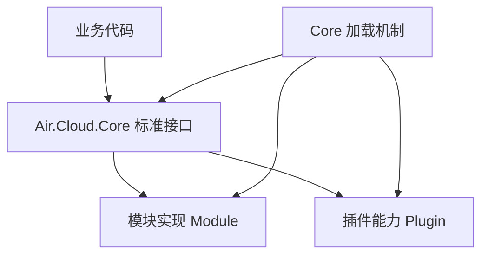
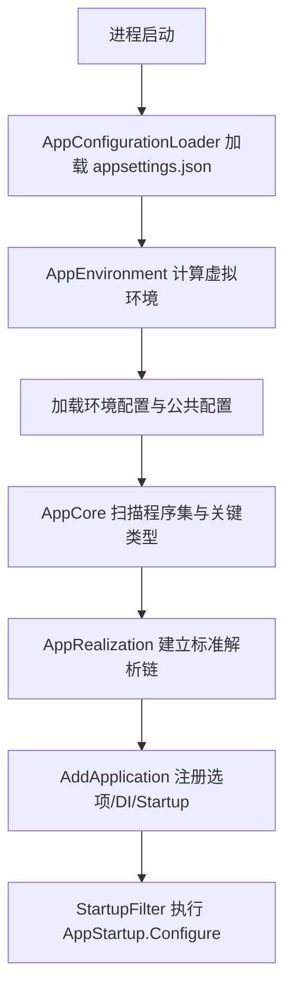

# 设计理念

Air.Cloud 的设计目标不是提供一个“全家桶”，而是把框架能力拆成可替换的标准和实现。业务项目只依赖标准，具体能力由模块或插件补齐。

这个设计有一个明确边界：`Air.Cloud.Core` 负责定义规则、加载资源、协调启动；Redis、Kafka、Consul、Web 服务、数据库等具体能力不应该沉淀在 Core 里。


---

## 核心定位

`Air.Cloud.Core` 主要负责：

- 定义标准接口，例如缓存、配置、消息队列、JSON、压缩、追踪日志等。
- 维护 `AppRealization`，统一暴露标准实现。
- 维护加载机制，决定应用启动时如何扫描、注入、排序和执行启动项。
- 提供默认兜底实现，例如输出、配置、JSON、压缩等。
- 对没有默认实现的能力抛出明确异常，提示需要引入模块或自行实现。

`Air.Cloud.Core` 不应该负责：

- 直接连接 Redis。
- 直接连接 Kafka。
- 直接提供 Web 服务。
- 直接实现 Consul、数据库、远程调用等具体能力。

这些能力应该由对应模块或插件完成。

---

## 分层关系

Air.Cloud 的主体分为三层：

| 层级 | 作用 | 是否建议业务直接依赖 |
| --- | --- | --- |
| Core | 定义标准、维护加载机制、提供少量默认实现 | 是 |
| Module | 实现运行时能力，例如 Kafka、Redis、Consul | 按需依赖 |
| Plugin | 增强应用能力，例如 JWT、接口文档、API 目录 | 按需依赖 |

关系可以理解为：



业务代码应该尽量调用 `AppRealization` 暴露的标准，或者通过 DI 使用标准接口，而不是直接绑定某个具体模块。这样后续切换实现时，业务代码不需要大改。

---

## 为什么 Core 只做核心

如果 Core 同时实现 Kafka、Redis、Consul、数据库、Web 服务等能力，会带来几个问题：

- 引用膨胀：一个简单服务也会携带大量无关依赖。
- 替换困难：默认实现越重，业务越难覆盖。
- 版本冲突：不同能力依赖不同第三方包，容易互相牵制。
- 启动复杂：所有能力都在核心中，加载链路会越来越不可控。

所以 Air.Cloud 选择让 Core 保持克制：

- 能定义成标准的，放在 Core。
- 能被替换的，做成 Module。
- 能增强 Web/API 能力的，做成 Plugin。
- 能作为兜底基础能力的，才提供默认实现。

---

## 标准优先

标准是框架能力的契约，例如：

```csharp
IAppCacheStandard
IMessageQueueStandard
IAppConfigurationStandard
IJsonSerializerStandard
ITraceLogStandard
```

业务侧应该按下面方式理解它们：

```csharp
// 业务只关心缓存标准，不关心当前到底是 Redis、Memory 还是其他实现。
var cache = AppRealization.Cache;
cache.SetCache("user:1", "value");
```

如果需要替换实现，优先替换标准实现，而不是修改业务调用点。

---

## 模块承担运行时能力

模块通常承担“服务运行必须连接外部资源”的能力，例如：

- `Air.Cloud.Modules.Kafka`：实现消息队列标准。
- `Air.Cloud.Modules.RedisCache`：实现 Redis 缓存标准。
- `Air.Cloud.Modules.Consul`：实现配置中心、注册中心、键值对中心。
- `Air.Cloud.Modules.Quartz`：实现调度任务能力。

模块一般会提供 `AddXXXService()` 或 `AddXXX()` 之类的注册方法。注册后，模块会把自己的标准实现放入 DI 或 `AppRealization` 的解析链路中。

---

## 插件承担增强能力

插件更适合处理“应用增强”，例如：

- 认证鉴权。
- OpenAPI / Swagger 文档。
- API 探针与目录。
- 代码生成。

插件不应该承担复杂业务流程。复杂流程应该放在业务服务或模块中，插件只负责补齐入口、过滤器、中间件或辅助能力。

---

## 加载机制是 Core 的核心

`Air.Cloud.Core` 的真正核心是加载机制。它解决的问题是：应用启动时，框架如何发现模块、插件、标准实现、启动项，并按正确顺序装配到应用里。

核心链路如下：



这里需要注意两个关键点：

1. `AppCore` 的静态构造会扫描程序集，并把类型分成 Standard、Module、Plugin、Enhance、Startup 等集合。
2. `AppRealization` 会用 `InternalRealization.X ?? DefaultRealization.X` 的方式对外暴露标准实现。

也就是说，Core 不是单纯的接口包，它是“标准 + 加载运行时”。

---

## 替换实现的方式

常见替换方式有三种：

### 1. 注册到 DI

适合大多数模块实现：

```csharp
services.AddSingleton<IAppCacheStandard, MyCacheStandard>();
```

`AppRealization.Cache` 会优先尝试从 `AppCore.GetService<IAppCacheStandard>()` 获取实现。

### 2. 使用 SetDependency

适合覆盖 Core 中维护的内部字段，例如输出、配置、注入标准等：

```csharp
AppRealization.SetDependency<IAppConfigurationStandard>(new MyConfigurationStandard());
```

建议在 `AppStartup.ConfigureServices` 或模块注册过程中调用，不建议在 `Program.cs` 过早调用。

### 3. 引入模块包

如果模块类型实现了 `IStandard`，并能被扫描到，框架会把它纳入标准类型集合。对于可反射填充的内部字段，`AppRealization` 会尝试创建实现实例。

如果同一个标准被扫描出多个实现，框架会输出错误提示。此时应该保留一个默认实现，或者在业务侧明确注册需要使用的实现。

---

## 设计收益

- 可替换：业务面向标准，不被某个模块锁死。
- 可裁剪：不用 Kafka 就不引用 Kafka，不用 Redis 就不引用 Redis。
- 可演进：新增消息队列、缓存、配置中心时，不需要改 Core。
- 可诊断：加载失败时，可以沿着配置、程序集扫描、标准解析、Startup 执行逐层排查。

---

## 设计代价

这种设计也有代价：

- 启动链路比普通 WebAPI 项目更复杂。
- 模块没有注册时，部分标准会抛出 `NotImplementedException`。
- 多个实现同时存在时，需要明确选择一个实现。
- 自定义实现需要理解接口标准和加载时机。

这不是缺陷，而是模块化框架必须面对的复杂度。Air.Cloud 的重点是把复杂度集中在 Core 的加载机制里，而不是散落在业务项目中。
